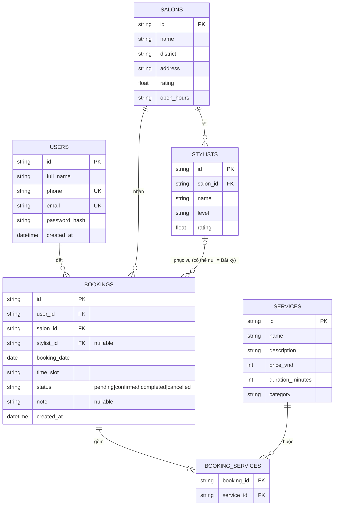

# Thiết kế cơ sở dữ liệu — 30Shine Booking

> Giai đoạn Thiết Kế (Slot 6). Thiết kế theo mô hình quan hệ để dễ chọn MySQL/SQL Server
> ở Slot 12; phần "Nếu chọn NoSQL" bên dưới ánh xạ sang MongoDB/Firestore nếu nhóm chọn hướng đó.
> **Không dùng SQLite** làm database chính, theo đúng yêu cầu đề PE.

## Sơ đồ ERD



## Danh sách bảng

| Bảng | Vai trò |
|---|---|
| `users` | Tài khoản khách hàng (đăng ký/đăng nhập) |
| `salons` | Chi nhánh 30Shine (địa chỉ, giờ mở cửa, đánh giá) |
| `stylists` | Thợ cắt thuộc từng chi nhánh |
| `services` | Danh mục dịch vụ dùng chung cho mọi chi nhánh (cắt/gội, nhuộm, uốn, combo) |
| `bookings` | Một lượt đặt lịch: ai, ở đâu, thợ nào (có thể để trống = "Bất kỳ"), ngày giờ, trạng thái |
| `booking_services` | Bảng nối N–N: một lịch hẹn có thể gồm nhiều dịch vụ |

## Quan hệ chính

- 1 user → N bookings
- 1 salon → N stylists, N bookings
- 1 stylist → N bookings (cho phép `stylist_id = null` nghĩa là "Bất kỳ thợ nào")
- 1 booking ↔ N services (qua `booking_services`)

## Nếu chọn NoSQL (MongoDB / Firestore) thay vì SQL

Gộp `booking_services` vào chính document `bookings` dưới dạng mảng nhúng, không cần bảng nối:

```json
{
  "_id": "bk1",
  "userId": "u1",
  "salonId": "sl1",
  "stylistId": null,
  "services": [
    { "serviceId": "sv1", "name": "Cắt gội cơ bản", "priceVnd": 89000, "durationMinutes": 30 }
  ],
  "date": "2026-09-16",
  "timeSlot": "14:00",
  "status": "pending",
  "note": null,
  "createdAt": "2026-09-16T07:00:00Z"
}
```

`users`, `salons`, `stylists`, `services` giữ nguyên là các collection riêng.

## Trạng thái ứng dụng hiện tại (Slot 6)

Toàn bộ `lib/repositories/*` đang chạy trên dữ liệu mock trong bộ nhớ (giống pattern
`FakeDatabase` học ở Module 9), để UI chạy được ngay không cần chờ backend. Ở Slot 12,
chỉ cần thay nội dung 2 file `auth_repository.dart` và `booking_repository.dart` bằng các
lệnh gọi `http` tới REST API thật — `AuthProvider`/`BookingProvider` và toàn bộ UI phía
trên không cần sửa, vì chúng chỉ phụ thuộc vào chữ ký hàm của repository (Repository
pattern, Module 3).
